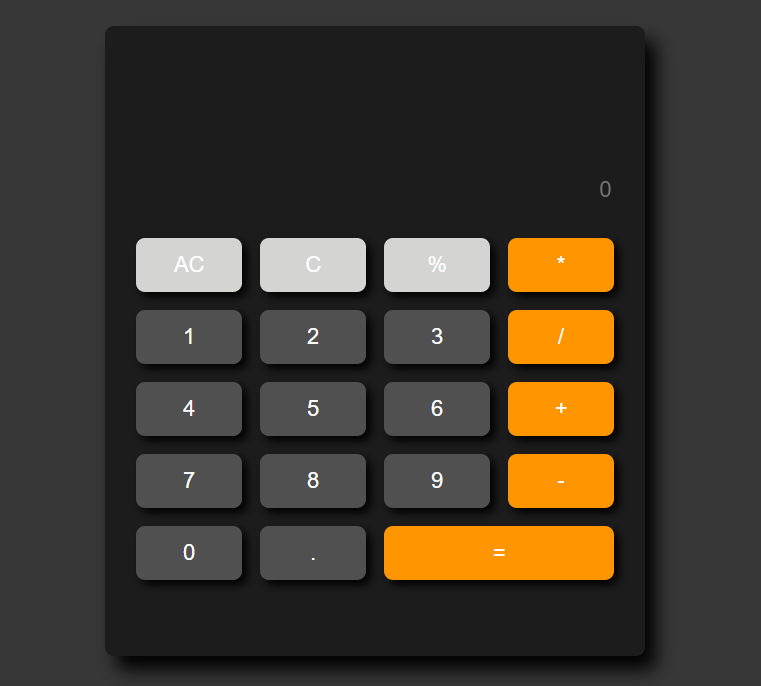
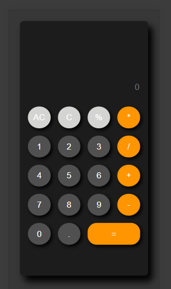

# Simple-Calculator
This is a simple calculator application built using HTML, CSS, JavaScript.
 

# Features 
- Basic Operations: Addition, subtraction, multiplication, division and modulo.
- Addition Function: Clear All (AC), delete (C).
- Steps check: User can see steps of every equation.
- Keyboard Support: User can also use their keyboard for input.
- Responsive Design: The calculator interface is responsive.
 

# Technologies Used
- HTML: For structuring the calculator.
- CSS: For Styling.
- JavaScript: For imlementing the calculator logic.
